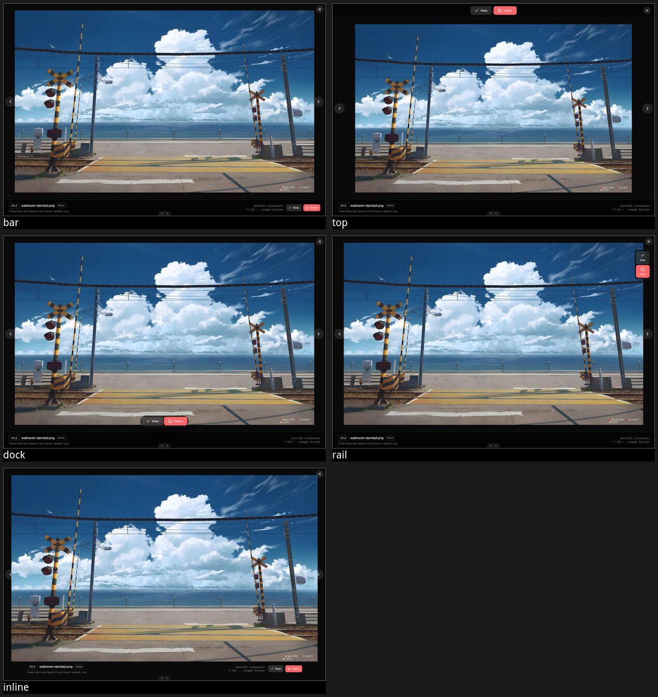
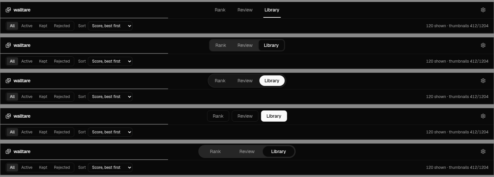
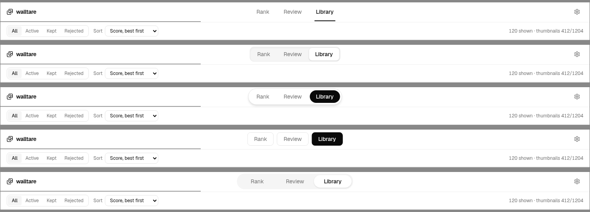
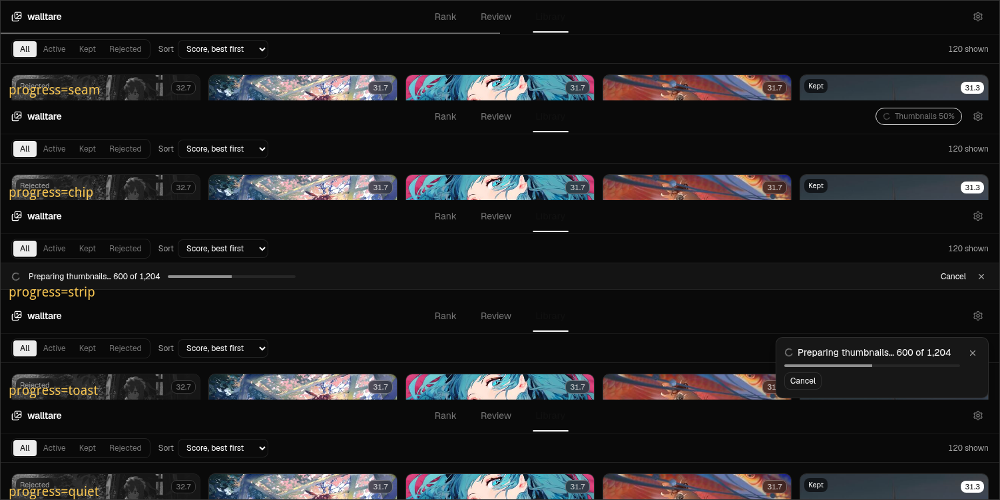

# Prototype: the shell, the library grid, and the lightbox

Throwaway. For [#44](https://github.com/QuantumFF/walltare/issues/44) and now
[#59](https://github.com/QuantumFF/walltare/issues/59), on the
`prototype/shell-library-lightbox` branch, and it is not going to main.

Three variants of the whole surface, switchable in the browser. No IPC and no
Tauri: `src/lib/client.ts` is the only module allowed near `invoke`, and a
prototype has no business going through it.

## Running it

```sh
./src/prototype/gen-images.sh   # once, ~2 min, reads the live DB
bun run prototype               # opens http://localhost:5273/prototype.html
```

`gen-images.sh` resizes the real library into `public/proto-images/`
(gitignored, 28MB): 512px for cards and rows, 1600px for the lightbox. Without
it every image is a broken icon and nothing about density is judgeable.

## Driving it

The bar at the bottom is the harness, not the design. It is deliberately ugly.

| control | what it does |
| --- | --- |
| `alt+←` / `alt+→` | previous / next variant. Alt because the lightbox under test claims the bare arrows |
| `alt+↑` / `alt+↓` | previous / next progress housing, variant A only. The live axis |
| `r` | rerun the selected timeline |
| `h` | hide the bar. It sits over variant A's caption bar. `?bar=off` starts it hidden |
| progress | the five housings for background work, below. The live question |
| run / hold | start, stop and freeze a background-work timeline |
| actions | the five housings for Keep / Reject / Restore in the lightbox. Settled: `inline` |
| tabs | the five housings for A's tab group. Settled: `underline` |
| page | rank, review, library, settings |
| state | ready, loading, empty |
| dark / light | both themes, since the rank surround is fixed dark in both |

Every control is a URL parameter, so a link is a state:
`?variant=A&page=library&theme=light&header=island&open=6`. `open=<n>` opens the
lightbox on the nth row of whatever list is showing. `?run=rescan` starts a
timeline on load and `?at=4500` freezes it that many milliseconds in, so a
moment mid-pass is linkable and screenshottable.

Inside the app: click a card to open the lightbox, `←` `→` to move, `Esc` to
close. Variant B also walks the grid with arrow keys and opens on `Enter`.
Variant C's lightbox has `i` for details.

## The three variants

**A — Toolbar.** Chrome is one fixed row: brand, tabs, gear. Everything a page
needs sits in a second bar underneath that the page owns, so the chrome never
changes height. Pre-generation is a 2px seam across the full width. The grid is
the existing Review card at higher density, actions in a hover overlay. The
lightbox puts identity, numbers, and actions in one caption bar along the
bottom.

**B — Inspector.** The bet: a wallpaper's actions do not belong on the
wallpaper. Tiles carry nothing but the badge, and a 320px right-hand panel holds
the metadata and every action for whatever is selected. Arrow keys walk the
grid, `Enter` opens. This is the variant that answers the map's fog patch on
keyboard reachability structurally rather than by bolting focus states onto a
`group-hover` overlay. Round and Evaluated live in the chrome as chips, so Rank
needs no second bar. Settings is a sheet.

**C — List.** The provocation: a library in the low thousands is a list, not a
wall. Sortable columns, a thumbnail chip, always-visible actions, a fixed row
height that makes virtualisation arithmetic trivial. Worst of the three for
judging pictures, best for finding a file. Settings is a fourth tab.

## The five action housings (variant A's lightbox)

Round two's question, settled: `inline` won, and ADR 0019 built on it. Where
Keep / Reject / Restore sit while a wallpaper is being previewed, and what
contains them. The dropdown stays; the keys moved to round three's axis. Link
one: `?variant=A&actions=dock&open=6`.

Identity (badge, filename, status, path) and the read-out (Score, comparison
count, position, keys) stay in the same place in all five. Only the buttons move.



| `actions=` | what it is |
| --- | --- |
| `bar` | right end of the bottom caption bar. What round one shipped: the decision is a corner of an information bar |
| `top` | its own bar above the image, buttons centred, close pushed right. The decision reads as the screen's title rather than its footer |
| `dock` | a floating pill over the image, centred, holding nothing but the decision. How a phone gallery does it |
| `rail` | a vertical column on the right edge, below the close button. Icon over label, and the bottom bar stays purely informational |
| `inline` | under the image, at the image's width rather than the window's, so the controls belong to the picture |

`inline` needs a live look rather than a screenshot: its row width is measured
off the rendered image, and headless Chrome resizes the viewport after the
measurement lands, so a captured frame shows the row one layout stale. In a real
browser the observer fires on resize and it tracks.

## The five tab housings (variant A)

Settled: `underline`. Kept switchable because the branch is throwaway and they
cost one dropdown. Same tabs, same place, same 48px row in all five, so the only
variable was how hard the group asserts itself against the brand on its left and
the gear on its right.





| `header=` | what it is |
| --- | --- |
| `underline` | no container. The chrome's own bottom edge is the indicator, so the tabs read as a document's sections rather than as a control |
| `segmented` | sunk into the bar, active tab a raised chip. One control, not three links |
| `island` | its own surface, border and shadow, lifted off the bar. Most assertive, and the active tab inverts |
| `boxed` | three separate outlined boxes, no shared container. Loudest per tab, quietest as a group |
| `sliding` | one pill with a single indicator that animates between fixed-width tabs. The only housing where switching pages moves something |

Two things to weigh while flipping:

- In dark, `segmented`'s active chip is darker than its own container, so it
  reads as pressed in rather than raised. `island` and `boxed` invert instead
  and stay consistent between themes.
- In light, `sliding`'s white indicator on a light grey track is the weakest
  active state of the five. It is the one that needs a colour if it wins.

## The five background-work housings (variant A)

Round three, for [#59](https://github.com/QuantumFF/walltare/issues/59). Where
a scan, the pre-generation pass behind it, and whatever scan-complete has to
say show up in a shell whose chrome is one fixed 48px row.

**Settled: `toast`**, pinned, on a second slot below ADR 0017's transitions, so
a keep covers the report for eight seconds and then the report comes back.
ADR 0021 has the reasoning and the two Radix mechanics it leans on. The other
four stay switchable, and the two that lost narrowly are worth knowing about:
`chip` is the only housing a transition never covers, and `strip` is the most
legible of the five and moves the page every time a pass starts or ends.

Pick a `run`, press run, and flip housings with `alt+↑` / `alt+↓` while it
plays. One second is one minute of the real pass, so the launch pass's 1,204
thumbnails take 8.4 seconds here and about 8.4 minutes on the machine.



| `progress=` | what it is | where the ending goes |
| --- | --- | --- |
| `seam` | round one's 2px line across the chrome | the toast slot |
| `chip` | a bordered chip left of the gear: `Scanning`, then `Thumbnails 49%`. Click lands on Settings, where ADR 0020 put Cancel | the chip itself, then it goes |
| `strip` | the last row of the header, under the page's own bar: sentence, bar, Cancel, dismiss | the strip holds it, then retracts |
| `toast` | a pinned toast in ADR 0017's slot, top right | the same toast |
| `quiet` | nothing at all while it runs. The numbers are in Settings, where ADR 0020 already put them | the toast slot |

`seam` and `quiet` differ in exactly one thing, so the pair asks whether the
ambient line during the pass was worth anything. `chip` and `strip` differ in
whether the report gets a sentence. `toast` is the one that answers the
ticket's own question about an eight-second surface reporting fourteen minutes
of work: ADR 0017 already ships `duration: Infinity` for errors, so pinning it
costs nothing, and what it actually costs is the slot. Keep something during a
pass and watch the Keep toast wipe the report.

Four timelines, all built from the real event payloads:

| `run=` | what it plays |
| --- | --- |
| `launch` | the every-launch pass: 1,204 thumbnails, no scan |
| `rescan` | walk, insert, 412 new files, their thumbnails, then a Round drop from 4 to 1 |
| `nothing-new` | 2,000 files scanned, nothing new, and so no pass at all and no event |
| `no-images` | the folder holds no images. `NO_IMAGES_ERROR`, which ADR 0015 handed to this ticket |

### Three things read off the code before building this

They are in `backgroundWork.ts` as comments, and each one narrows the answer.

- **The walk is silent.** `scanner::collect_images` runs to completion before
  the first event (`lib.rs:178`), so however long a directory tree takes,
  nothing is emitted. The `walking` segment shows what that looks like.
- **The scan half has no denominator.** `scan-progress` carries
  `{scanned, added}` and no total. ADR 0012 asks for "one bar with two phases",
  and phase one can only ever sweep. Every housing here sweeps during the scan
  and fills during pre-generation, which is the honest reading, and it is worth
  deciding whether one surface should change meaning that way at all.
- **The scan's own progress is nearly instantaneous anyway.** The loop that
  emits is chunked at `SCAN_CHUNK_SIZE = 256` inserts, so the live
  120-wallpaper library produces exactly one `scan-progress` event, at 100%,
  and 5,000 wallpapers produce twenty. The visible half of the two-phase bar is
  the cheap half.

### What the seam does in light

The 2px seam and the active tab's underline sit on the same horizontal rule, so
in light theme at some widths the seam reads as the underline getting longer.
That is on top of round one's complaint rather than instead of it.

### One option deliberately not on the axis

A strip in the page-owned second bar, which the ticket lists. It is left off
because the second bar belongs to a page and this work belongs to none of them:
Rank's bar is already full with the Round headline, Review's holds ADR 0018's
destination read-out, and putting the same pass report in all three is three
implementations of one shell-level fact. `chip` is the nearest thing on the
axis, moved up into the chrome where it can be written once. Say so if that
reasoning is wrong and it goes back on.

## The data

`library.json` is the live 120-wallpaper library, exported as-is: the real Score
spread, the real σ band, the real 45 Unrated wallpapers. `fixtures.ts` adds two
things on purpose and says so in a comment: statuses (every real row is Active,
so a filter would have nothing to filter) and an aged slice of 15 wallpapers
with σ under 4.0 (nothing in the live library is Evaluated, so the solid badge
would never render).

## What the reaction has to settle

Nothing. Round one picked A, round two `underline` for the tabs and `inline`
for the lightbox actions, round three `toast` for background work. ADR 0019
settled the card's affordance, ADR 0020 the Settings page, and ADR 0021 the
reporting, so this branch is now a record rather than a question.

What the last round settled, beyond the housing:

- The report shows on every view except the two that already carry the same
  numbers, Settings and the lightbox.
- The count stays, `240 of 1,204`, in ADR 0020's own words.
- Only pre-generation draws a bar. The scan phase is a line that counts up,
  because `scan-progress` has no total and its visible half is one event.
- A clean `pregen-complete` says nothing at all. `scan-complete` gets three
  outcomes, and the one with new files carries ADR 0008's Round message.
